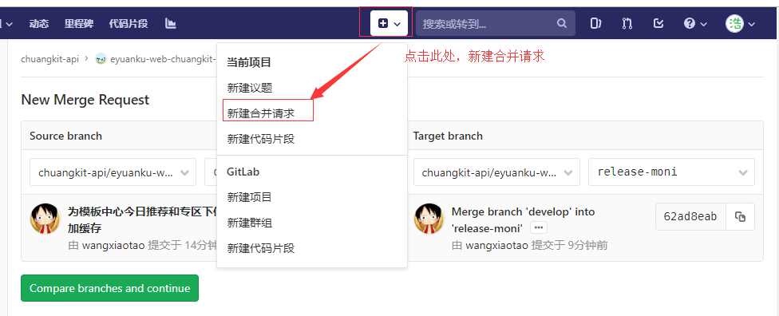

# 部署步骤

演示部署api-v2 

- 1) 进入gitlab页面，选中eyuanku-web-chuangkit-api-framework

- 2) 创建合并请求

选项如下：

- 3) 重复1,2 步骤在eyuanku-web-chuangkit-api 项目上

- 4) 进入eyuanku-web-chuangkit-api-framework,创建tag

- 5. 重复步骤4在eyuanku-web-chuangkit-api 项目上

- 6. jenkins查看

release-moni-1908052015lph

sql审核邮件功能新增