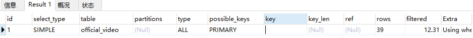
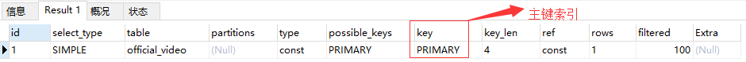

# 1. mysql mybatis注意事项 

## 1.1 sql语句中避免出现or (可能导致索引失效)

错误示例如下：
```sql
EXPLAIN select id,title
from official_video
where id = 110 or title = '葡萄'
```


正确示例如下： 
```sql
 select id,title from official_video where id = 110
```



## 1.2 <if test= "" />	尽量不要出现不是数据库表对应字段的情况
此处只做非空判断，值的判断逻辑交给service层

错误示例如下： 
```sql
<select id="getVideoKind" resultMap="detail">
    SELECT id,create_time,update_time,main_title,sub_title,sort,for_test
    FROM video_kind
    <if test="forTest >= 0">
        where for_test = #{forTest}
    </if>
    ORDER BY sort ASC
</select>
```

正确示例：
```sql
<select id="getVideoKind" resultMap="detail">
    SELECT id,create_time,update_time,main_title,sub_title,sort,for_test
    FROM video_kind
    <if test="forTest != null">
        where for_test = #{forTest}
    </if>
    ORDER BY sort ASC
</select>
```


## 1.3 连接查询表关联数控制在3个以内，有关系表的情况下，关系表作为主表

join 根据业务场景选择使用的连接方式， 
示例：查询模板列表，	attach 和 des_design_template

两张表，没有attach图片,没必要查出此行（null-前端显示也会出错）

## 1.4 排序操作优先选择主键id 作为排序字段，减少日期类字段的使用


## 1.5 on duplicate key update

数据量大的情况下，引起主键不连续自增，可能出现超越mysql int界限的情况	update
操作会是 increatment 自增数值 + 1

## 1.6 mysql 排序值相同情况下顺序错乱 根据createTime
升序查询，出现id值不是当前日期最小的情况，
 
 注：因为mysql在排序字段相同的话会随机排序的，并不是按照（Id升序或降序）

## 1.7 批量更新	(1.0版本)

```sql
    UPDATE
		des_design_template_ad
    SET view_times = 
        CASE design_template_ad_id
            <foreach collection="list" item="item" > 
                WHEN #{item.id} THEN #{}					
            </foreach>
        END
    WHERE
    design_template_ad_id IN
    <foreach collection="list" item="item" separator="," close=")" open="(" > 
        #{item.id} 
    </foreach>

   （2.0版本）
    UPDATE 
		print_center_page_item
    SET show_order =
    <foreach collection="list" item="item" index="index"
             separator=" " open="case ID" close="end">
        when #{item.id} then #{}
    </foreach>
    where id in
    <foreach collection="list" index="index" item="item"
             separator="," open="(" close=")">
        #{item.id}
    </foreach>
```
	
## 1.8 mapper 文件公用Do,sql抽离

```xml
<?xml version="1.0" encoding="UTF-8" ?>
<!DOCTYPE mapper PUBLIC "-//mybatis.org//DTD Mapper 3.0//EN" "http://mybatis.org/dtd/mybatis-3-mapper.dtd" >
<mapper namespace="com.eyuanku.web.chuangkit.api.framework.M.dao.VideoKindDao">

    <resultMap id="videoKindDoResult" type="com.eyuanku.web.chuangkit.api.framework.domain.dox.VideoKindDo" autoMapping="true"/>

    <sql id="videoKindDoSql">
        id,create_time,main_title,sub_title,sort,for_test
    </sql>
    
    <select id="getVideoKind" resultMap="videoKindDoResult">
        SELECT 
        <include refid="videoKindDoSql"/>
        FROM video_kind
        where for_test = #{forTest}
        ORDER BY sort ASC
    </select>

</mapper>
```

## 1.9 更新操作
  更新操作尽量采用主键更新。更新Dao接口方法名统一设置为：update 
 
## 2.0 mysql数据源选择

  事务操作：新增、删除、修改 也需要添加：
  @DataSourceRouter(DataSources.SLAVE_DB)

# 2.1 生成插入mapper的java代码
```java
	/**
     * 插入数据
     */
    private String getValues(Class clazz,boolean isBatch) {
        StringBuilder values = new StringBuilder();
        values.append("(");
        Field[] fields = clazz.getDeclaredFields();
        for (Field field : fields) {
            String propertyName = field.getName();
            if (propertyName.equals("createTime") || propertyName.equals("updateTime") || propertyName.equals("id")) {
                continue;
            }
            String isBatchStr = isBatch? "item.":"";
            String value = "#{"+ isBatchStr + propertyName + "}" + ",";
            if (fields[fields.length - 1].getName().equals(propertyName)) {
                value = "#{" + isBatchStr +propertyName + "}";
            }
            values.append(value);
        }
        values.append(")");
        return values.toString();
    }

    private String getCollValues(Class clazz) {
        StringBuilder values = new StringBuilder();
        values.append("(");
        Field[] fields = clazz.getDeclaredFields();
        for (Field field : fields) {
            String propertyName = field.getName();
            if (propertyName.equals("createTime") || propertyName.equals("updateTime") || propertyName.equals("id")) {
                continue;
            }
            propertyName = CaseFormat.LOWER_CAMEL.to(CaseFormat.LOWER_UNDERSCORE, propertyName);
            String value = "" + propertyName + "" + ",";
            if (fields[fields.length - 1].getName().equals(propertyName)) {
                value = "" + propertyName + "";
            }

            values.append(value);
        }
        values.append(")");
        return values.toString();
    }
```
		

# 参见
- [哪些情况下sql索引会失效](https://blog.csdn.net/JOJOY_tester/article/details/71104104)
