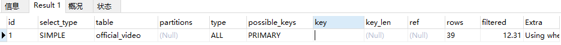
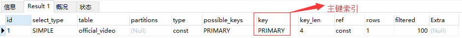

# mysql mybatis注意事项 

1) sql语句中避免出现or (可能导致索引失效)

错误示例如下：
```sql
EXPLAIN select id,title
from official_video
where id = 110 or title = '葡萄'
```


正确示例如下： 
```sql
 select id,title from official_video where id = 110
```



2) <if test= "" /> 
	尽量不要出现不是数据库表对应字段的情况
	此处只做非空判断，值的判断逻辑交给service层

错误示例如下： 
```sql
<select id="getVideoKind" resultMap="detail">
    SELECT id,create_time,update_time,main_title,sub_title,sort,for_test
    FROM video_kind
    <if test="forTest >= 0">
        where for_test = #{forTest}
    </if>
    ORDER BY sort ASC
</select>
```

正确示例：
```sql
<select id="getVideoKind" resultMap="detail">
    SELECT id,create_time,update_time,main_title,sub_title,sort,for_test
    FROM video_kind
    <if test="forTest != null">
        where for_test = #{forTest}
    </if>
    ORDER BY sort ASC
</select>
```


3) 连接查询表关联数控制在3个以内，有关系表的情况下，关系表作为主表
	join、left join 根据业务场景选择使用的连接方式，
		例如：查询模板列表，
			attach 和 des_design_template 两张表，没有attach图片,没必要查出此行（null-前端显示也会出错）

4) 排序操作优先选择主键id 作为排序字段，减少日期类字段的使用


5) on duplicate key update
	数据量大的情况下，引起主键不连续自增，可能出现超越mysql int界限的情况
	update 操作会是 increatment 自增数值 + 1

6) mysql 排序值相同情况下顺序错乱
 根据createTime 升序查询，出现id值不是当前日期最小的情况，
 
 注：因为mysql在排序字段相同的话会随机排序的，并不是按照（Id升序或降序）


7) 批量更新
	(1.0版本)

```sql
    UPDATE
    des_design_template_ad
    SET view_times = 
        CASE design_template_ad_id
            <foreach collection="list" item="item" > 
                WHEN #{item.id} THEN view_times + #{item.view}					
            </foreach>
        END
    WHERE
    design_template_ad_id IN
    <foreach collection="list" item="item" separator="," close=")" open="(" > 
        #{item.id} 
    </foreach>

   （2.0版本）
    UPDATE print_center_page_item
    SET show_order =
    <foreach collection="list" item="item" index="index"
             separator=" " open="case ID" close="end">
        when #{item.id} then #{item.showOrder}
    </foreach>
    where id in
    <foreach collection="list" index="index" item="item"
             separator="," open="(" close=")">
        #{item.id}
    </foreach>
```
	
		

# 参见
- [哪些情况下sql索引会失效](https://blog.csdn.net/JOJOY_tester/article/details/71104104)
